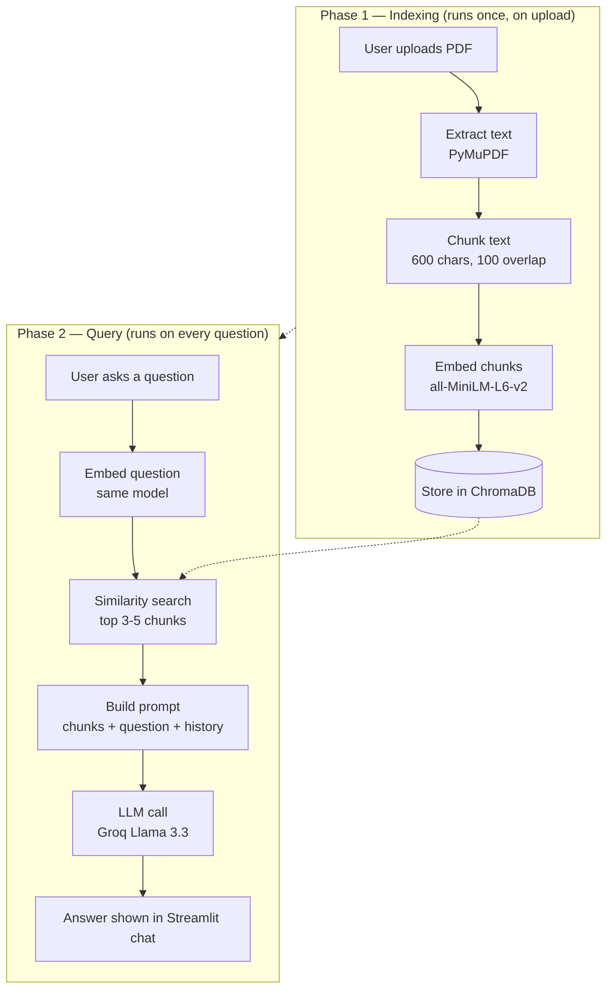

# 📄 PDF Chatbot — Chat with your documents

A Retrieval-Augmented Generation (RAG) chatbot that lets you upload any PDF and ask natural-language questions about it. Built as a standalone module for a larger hackathon project, but works fully independently.

## How it works

The system runs in two phases:

**1. Indexing (runs once, when a PDF is uploaded)**
- Extracts raw text from the PDF using PyMuPDF
- Splits the text into overlapping chunks (~600 characters each)
- Converts each chunk into a vector embedding using `all-MiniLM-L6-v2`
- Stores all chunks and their embeddings in a ChromaDB vector store

**2. Querying (runs on every question)**
- Embeds the user's question using the same embedding model
- Searches ChromaDB for the most semantically relevant chunks
- Sends those chunks, the question, and recent chat history to an LLM
- Returns an answer grounded only in the retrieved context

This means the model never sees the whole document at once — it only reasons over the small, relevant slice retrieved for each specific question. This keeps responses fast, cheap, and reduces hallucination.

## Workflow diagram



## Tech stack

| Component        | Tool                              |
|-------------------|------------------------------------|
| PDF parsing        | PyMuPDF                           |
| Chunking           | LangChain text splitters          |
| Embeddings         | sentence-transformers (`all-MiniLM-L6-v2`) |
| Vector store        | ChromaDB                          |
| LLM                | Groq (`llama-3.3-70b-versatile`)  |
| UI                  | Streamlit                         |

## Project structure

```
pdf-chatbot/
├── app.py            # Streamlit UI — orchestrates everything
├── ingest.py          # Phase 1: extract → chunk → embed → store
├── retriever.py        # Phase 2: embed question → similarity search
├── chatbot.py          # Builds prompt, calls the LLM, returns answer
├── requirements.txt
├── .env                # API keys (not committed)
├── .gitignore
└── sample_docs/
    └── contract.pdf    # sample document for testing
```

## Setup

1. Clone the repo and create a virtual environment:
```bash
git clone https://github.com/shreyapatro/pdf-chatbot.git
cd pdf-chatbot
python -m venv venv
venv\Scripts\activate      # Windows
source venv/bin/activate   # Mac/Linux
```

2. Install dependencies:
```bash
pip install -r requirements.txt
```

3. Create a `.env` file in the root folder:
```
GROQ_API_KEY=your-groq-api-key-here
```
Get a free key at [console.groq.com](https://console.groq.com).

4. Run the app:
```bash
streamlit run app.py
```

5. Upload a PDF and start asking questions.

## Status

This is an active work in progress. Current focus areas:
- [ ] Source citations (showing which page/chunk an answer came from)
- [ ] Error handling for scanned/unreadable PDFs
- [ ] Persistent vector storage across sessions
- [ ] Streaming responses

## Part of a larger project

This chatbot is being built as a module within a larger **Multi-Agent Contract Risk Intelligence System**, developed for a hackathon on agentic workflows.
