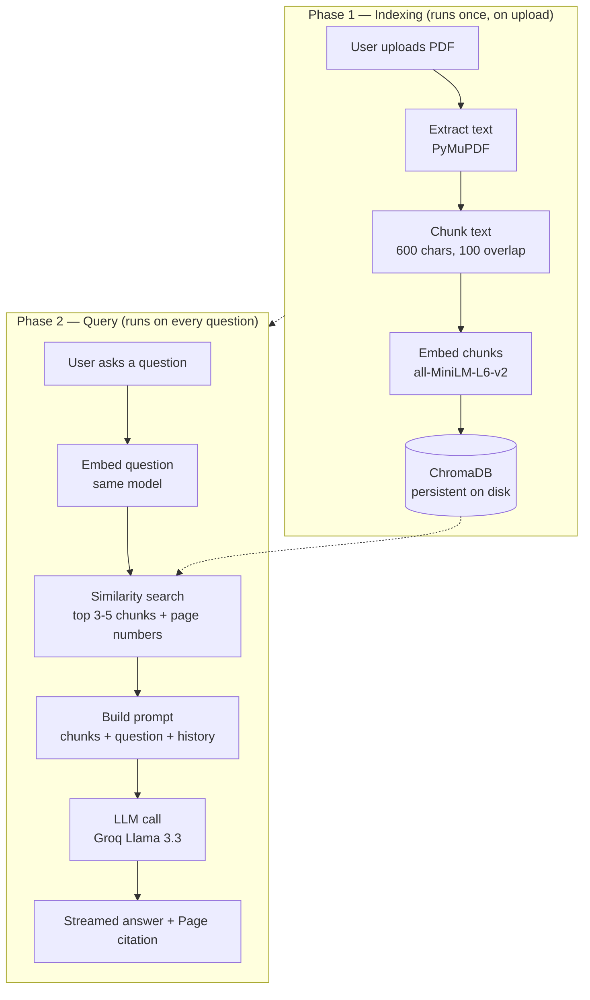

# 📄 PDF Chatbot — Chat with your documents

A Retrieval-Augmented Generation (RAG) chatbot that lets you upload any PDF and ask natural-language questions about it. Answers are grounded strictly in the document — the model never guesses from general knowledge.

## Features

- 💬 **Natural language Q&A** — ask anything about your document in plain English
- 📄 **Source citations** — every answer shows which page it came from
- ⚡ **Streaming responses** — words appear as generated, like ChatGPT
- 🔄 **Reset button** — switch documents without restarting the app
- 💾 **Persistent storage** — ChromaDB saves to disk, survives app restarts
- 🚀 **Auto-loads last document** — no re-upload needed on startup
- 🛡️ **Error handling** — scanned PDFs and API failures caught cleanly
- 🧠 **Conversation memory** — follow-up questions work naturally

## How it works

The system runs in two phases:

**1. Indexing (runs once, when a PDF is uploaded)**
- Extracts raw text from the PDF using PyMuPDF
- Splits the text into overlapping chunks (~600 characters each)
- Converts each chunk into a vector embedding using `all-MiniLM-L6-v2`
- Stores all chunks, embeddings, and page metadata in a persistent ChromaDB vector store

**2. Querying (runs on every question)**
- Embeds the user's question using the same embedding model
- Searches ChromaDB for the most semantically relevant chunks
- Sends those chunks, the question, and recent chat history to an LLM
- Returns a streamed answer grounded only in the retrieved context, with page citations

This means the model never sees the whole document at once — it only reasons over the small, relevant slice retrieved for each specific question. This keeps responses fast, cheap, and reduces hallucination.

## Workflow diagram



## Tech stack

| Component | Tool |
|---|---|
| PDF parsing | PyMuPDF |
| Chunking | LangChain text splitters |
| Embeddings | sentence-transformers (`all-MiniLM-L6-v2`) |
| Vector store | ChromaDB (persistent) |
| LLM | Groq (`llama-3.3-70b-versatile`) |
| UI | Streamlit |

## Project structure

```
pdf-chatbot/
├── app.py              # Streamlit UI — orchestrates everything
├── ingest.py           # Phase 1: extract → chunk → embed → store
├── retriever.py        # Phase 2: embed question → similarity search
├── chatbot.py          # Builds prompt, calls the LLM, streams answer
├── requirements.txt
├── .env                # API keys (not committed)
├── .gitignore
└── sample_docs/
    └── contract.pdf    # sample document for testing
```

## Setup

1. Clone the repo and create a virtual environment:
```bash
git clone https://github.com/shreyapatro/pdf-chatbot.git
cd pdf-chatbot
python -m venv venv
venv\Scripts\activate      # Windows
source venv/bin/activate   # Mac/Linux
```

2. Install dependencies:
```bash
pip install -r requirements.txt
```

3. Create a `.env` file in the root folder:
```
GROQ_API_KEY=your-groq-api-key-here
```
Get a free key at [console.groq.com](https://console.groq.com).

4. Run the app:
```bash
streamlit run app.py
```

5. Upload a PDF and start asking questions. On subsequent runs, the last document loads automatically.

## What I learned building this

- PDF parsing and how digital vs scanned PDFs differ
- Text chunking strategy and why overlap matters
- How embedding models convert meaning into vectors
- RAG architecture — retrieval before generation
- Prompt engineering to ground an LLM to a specific document
- Streaming APIs and Python generators
- Persistent vs in-memory storage
- Streamlit session state management
- Git version control end to end

## Roadmap

- [ ] Multi-document support — query across several PDFs at once
- [ ] Re-ranking — two-stage retrieval for better answer quality
- [ ] Table-aware parsing — preserve structure of pricing/schedule tables
- [ ] Scanned PDF support via OCR or VLM
